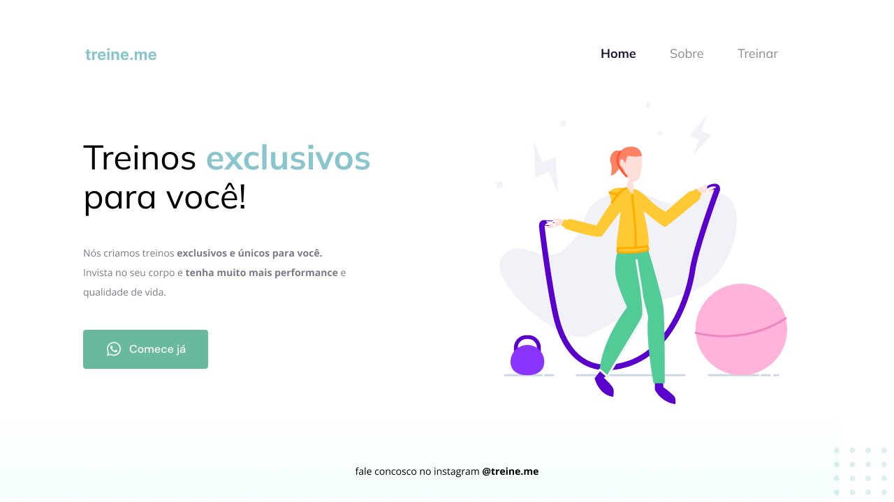

<h1 align="center"> Treine.me </h1>

 

  

## 🚀 Tecnologias

Esse projeto foi desenvolvido com as seguintes tecnologias:

- HTML e CSS
- Git e GitHub 

## 💻 Descrição

A tela foi criada para divulgar os treinos exclusivos de uma empresa fictícia. 

- [Acesse o projeto finalizado, online](https://andresa43.github.io/projeto_treino/)

## 🔖 Layout

Você pode visualizar o layout do projeto através [DESSE LINK](https://www.figma.com/file/0pafEU0RobIXPzrBQ4Tx1C/Explorer---Projeto-02-(Copy)?t=U7cDANZVPAU1VOHI-0). É necessário ter conta no [Figma](https://figma.com/) para acessá-lo.

## 📝 Licença

Esse projeto está sob a licença MIT.

---

Feito com ♥ Rocketseat 👋 [Acesse a comunidade!](https://discord.gg/rocketseat)
